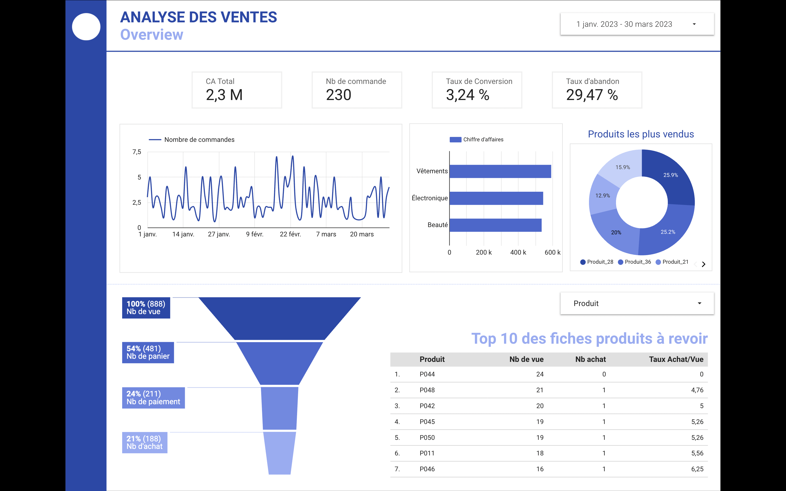

# dbt_sales_analysis – Analyse produit 360° avec dbt, BigQuery et Looker Studio

Ce projet simule l'analyse complète de la performance des produits dans un tunnel de vente e-commerce, depuis la visualisation produit jusqu'à l'achat. Il s'appuie exclusivement sur les outils gratuits dbt, BigQuery (en mode sandbox) et Looker Studio.

---

## Objectifs

- Construire un pipeline analytique clair et modulaire avec dbt.
- Modéliser un parcours client à partir d’événements (funnel : vue > panier > achat).
- Calculer des indicateurs clés : taux de conversion, panier abandonné, chiffre d'affaires.
- Restituer les résultats dans Looker Studio.

---

## Architecture du projet

``` 
products.csv       orders.csv       events.csv
     │                  │                  │
     ▼                  ▼                  ▼
  stg_products       stg_orders        stg_events
         \             /                /
          \           /                /
            → intermediate.int_funnel ←
                      │
                      ▼
             marts.mart_product_perf
``` 

---

## Modèles dbt

| Modèle                  | Description                                                  |
|-------------------------|--------------------------------------------------------------|
| `stg_products`          | Nettoyage du catalogue produit.                              |
| `stg_orders`            | Nettoyage des commandes client.                              |
| `stg_events`            | Nettoyage des événements front (clic, panier, achat, etc.).  |
| `int_funnel`            | Construction du parcours client (vue, panier, achat).        |
| `mart_product_perf`     | Table finale avec les KPIs : CA, conversion, abandon.        |

---

## Indicateurs calculés

- Nombre de vues, ajouts au panier et achats.
- Taux de conversion par produit.
- Taux d’abandon de panier.
- Quantité vendue.
- Chiffre d’affaires total par produit.
- Classement des catégories par performance.

---

## Tests dbt

Tous les modèles sont testés avec les packages de tests intégrés :

- `not_null` et `unique` sur les identifiants clés.
- `accepted_values` pour les types d’événements.
- `accepted_range` pour les taux de conversion.

---

## Documentation interactive

La documentation est générée automatiquement à l’aide de :

``` 
dbt docs generate
dbt docs serve
``` 

Accès local : [http://localhost:8000](http://localhost:8000)

---

## Dashboard Looker Studio

Le modèle `mart_product_perf` est exposé dans Looker Studio via BigQuery pour une visualisation simple et dynamique des performances produits.

**Lien vers le rapport public :**  
[Rapport Looker Studio – Product 360°](https://lookerstudio.google.com/s/sal_t8YHOEI)

---

## Reproduire le projet

### Prérequis

- Un compte Google Cloud (BigQuery sandbox suffit).
- Python ≥ 3.9.
- dbt installé avec l’adaptateur BigQuery :

``` 
pip install dbt-core dbt-bigquery
``` 

### Étapes

1. Cloner ce dépôt GitHub.
2. Copier les fichiers `.csv` dans le dossier `seeds/`.
3. Créer le fichier `~/.dbt/profiles.yml` avec le contenu suivant :

``` 
dbt_sales_analysis:
  target: dev
  outputs:
    dev:
      type: bigquery
      method: oauth
      project: ton-projet-gcp
      dataset: dbt_sales_analysis
      location: EU
      threads: 2
``` 

4. Exécuter les commandes suivantes :

``` 
dbt debug
dbt seed
dbt run
dbt test
``` 

---

## Auteur

Projet personnel réalisé par [Yoann Donkerque](https://www.linkedin.com/in/yoanndonkerque).  
Rôle : Analytics Engineer & Data Analyst.

